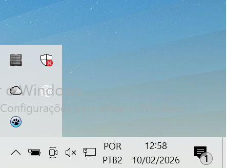
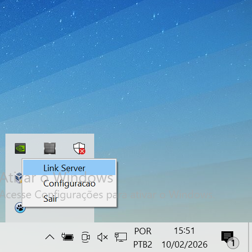

# Guia do Operador - Sistema de Portaria (Server + Link Server)

Este documento une as orientacoes de operação do `Server` e do `UDPClient` para a configuração do Sistema de Portaria em rede.

## Objetivo
Garantir que os computadores cliente consigam localizar o servidor e receber a configuração correta de conexao.

## Programas usados
- `SistemaPortariaServer.exe` (executar no computador servidor)
- `prjUDPClient.exe` (executar no cliente)

## Fluxo recomendado
1. No computador servidor, abra `SistemaPortariaServer.exe`.
2. Confirme o icone na bandeja do Windows.

3. No computador cliente, abra `prjUDPClient.exe`.
4. No icone da bandeja do cliente, clique com o botao direito e escolha `Link Server`.

5. Aguarde a mensagem final.
6. Confirme se o status da configuracao aparece como `SUCESSO`.

## O que o operador deve conferir no popup do `Link Server`
- IP do servidor encontrado
- caminho do banco no servidor
- pasta de imagens compartilhada no servidor
- status da configuracao do cliente (`SUCESSO` ou `ERRO`)

## Interpretacao do resultado

### `SUCESSO`
- A configuracao foi aplicada.
- Pode abrir o sistema normalmente.

### `ERRO`
- Tente novamente em alguns segundos.
- Verifique se o `SistemaPortariaServer.exe` continua aberto no servidor.
- Se persistir, acione suporte e informe a mensagem exibida.

## Regras praticas para o operador
- Nao feche o servidor durante o expediente.
- Evite alterar configuracoes manualmente sem orientacao.

